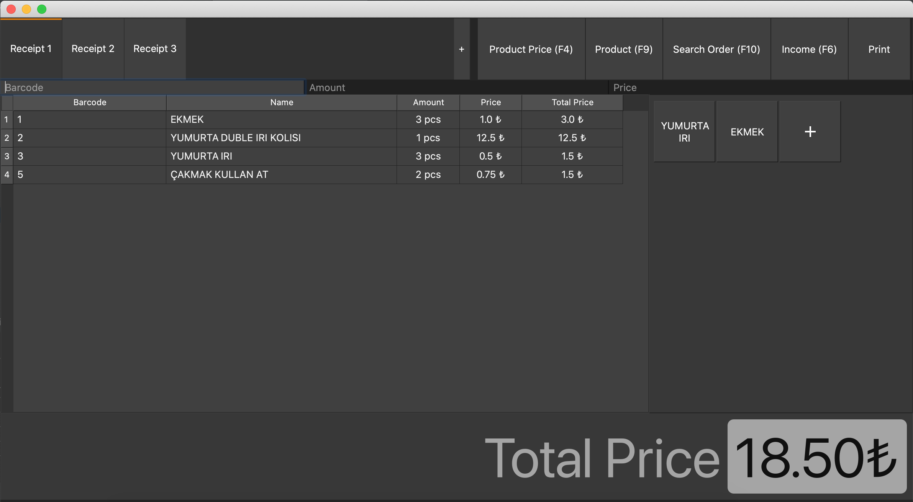
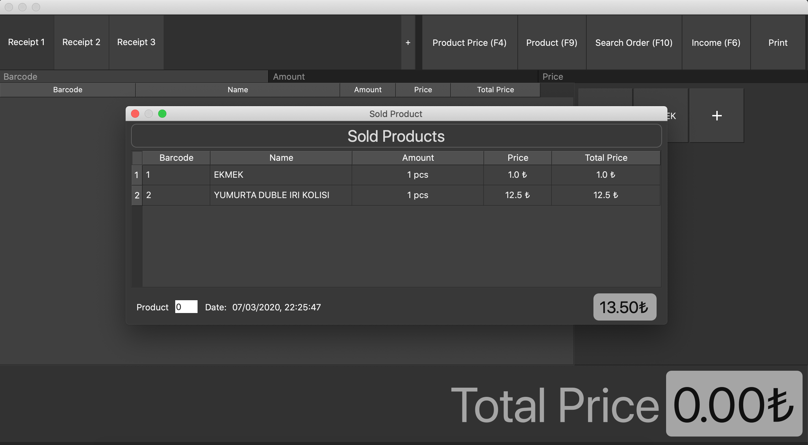
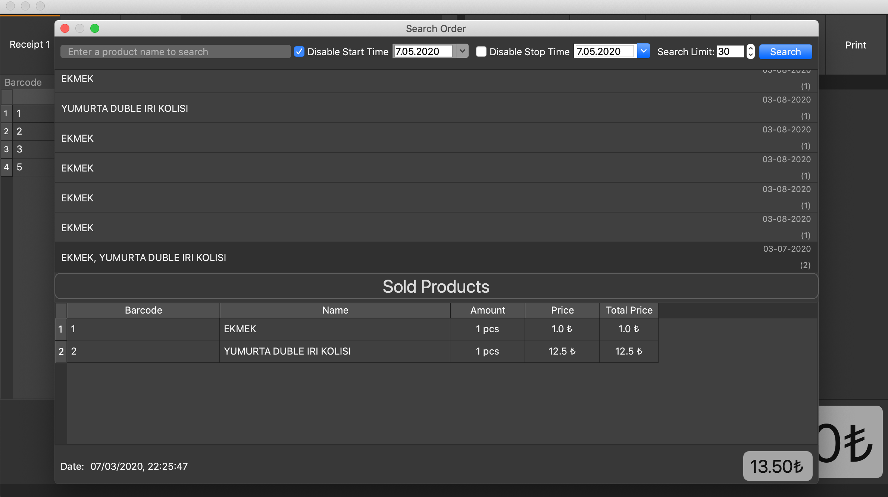
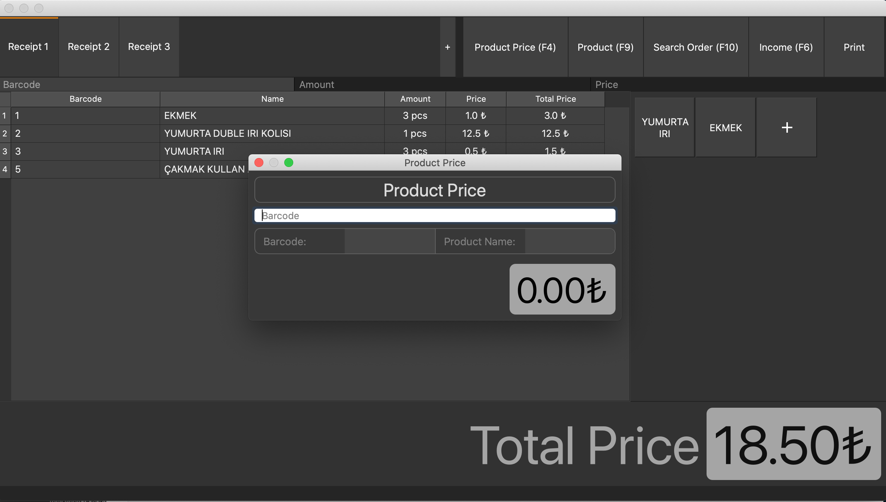
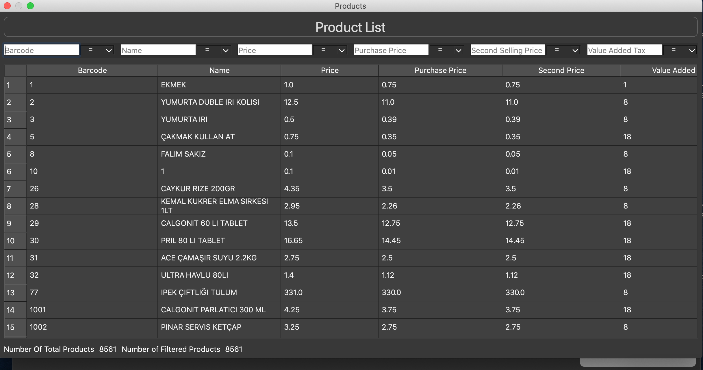
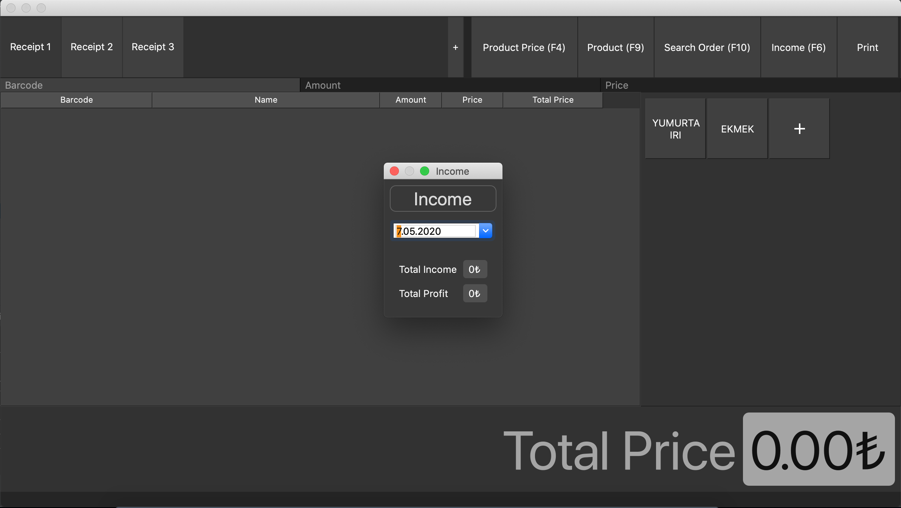

## Bu Bir Perakende Satış Programıdır.
- Bu program qt framework kullanılarak geliştirilmiştir.
- __İsteyen herkes bu programı istediği gibi kullanabilir.__
- Lightweight bir programdır.
- İçerdiği özellikler
    - Ürün Eklemek
    - Ürün Silmek
    - Sipariş Oluşturmak
    - Siparişin Satışını Yapmak
    - Girilen Bir Ürünü Aramak
    - Girilen Bir Siparişi Aramak
    - Günlük Toplam Gelir ve Kar Bilgisini Tutmak
    
## Üründen Görseller













## Gereksinimler
- Python 3
- PySide2 (kullanılan versiyon 5.11.0'dır)
- SQLAlchemy (database işleri için kullanıldı)
- fbs     (uygulamayı freeze yapabilmek için kullanıldı)

## Yükleme
Yükleme için 'requirements.txt' dosyası ile aynı dizinde olmalısınız
```
pip install -r requirements.txt
```
## Kullanım
Kullanım için 'README.md' dosyası ile aynı dizinde olmalısınız ve terminal içinde aşağıdaki kod satırını yazmanız yeterli olacaktır 
```
fbs run
```